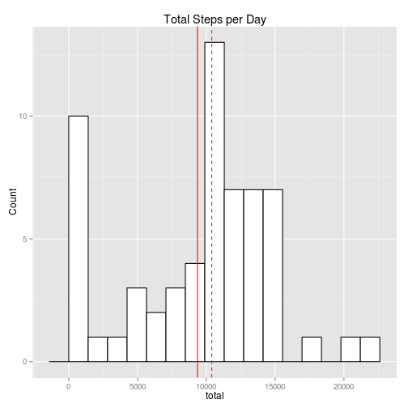
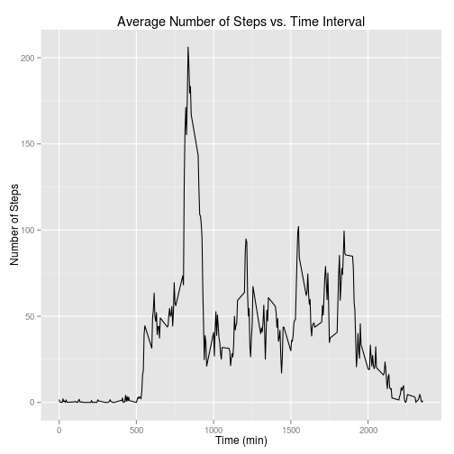
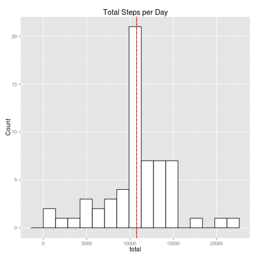
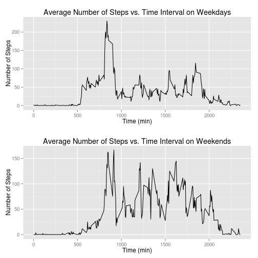

---
title: "Reproducible Research: Peer Assessment 1"
output: 
  html_document:
    keep_md: true
---  

## Required Packages

This document requires the packages:  
- lubridate  
- dplyr  
- ggplot2  
- gridExtra

```r
require(lubridate)
```

```
## Loading required package: lubridate
```

```r
require(dplyr, warn.conflict = FALSE)
```

```
## Loading required package: dplyr
```

```r
require(ggplot2)
```

```
## Loading required package: ggplot2
```

```r
require(gridExtra)
```

```
## Loading required package: gridExtra
## Loading required package: grid
```

## Loading and preprocessing the data


```r
data <- read.csv(unz("activity.zip", "activity.csv"), as.is = TRUE)
data$date <- ymd(data$date)
data <- tbl_df(data)
```


## What is mean total number of steps taken per day?


```r
steps_per_day <- group_by(data, date) %>%
        summarize(total = sum(steps, na.rm = TRUE))

ggplot(steps_per_day, aes(x = total)) + 
        geom_histogram(binwidth = max(steps_per_day$total)/15,
                       color = "black", fill = "white") +
        geom_vline(xintercept = mean(steps_per_day$total),
                 color = "red", label = "Mean",
                 show_guide = TRUE) +
        geom_vline(xintercept = median(steps_per_day$total),
                 color = "red", label = "Median", linetype = "dashed", 
                 show_guide = TRUE) +
        ggtitle("Total Steps per Day") + 
        ylab("Count")
```

 

```r
steps_per_day_mean <- round(mean(steps_per_day$total), 4)
steps_per_day_median <- median(steps_per_day$total)
```

The mean total number of steps per day is 9354.2295.  
The median total number of steps per day is 10395.  

## What is the average daily activity pattern?


```r
mean_time_steps <- group_by(data, interval) %>%
        summarize(average = mean(steps, na.rm = TRUE))

ggplot(mean_time_steps, aes(x = interval, y = average)) + 
        geom_line() + 
        xlab("Time (min)") + 
        ylab("Number of Steps") + 
        ggtitle("Average Number of Steps vs. Time Interval")
```

 


```r
max_int <- filter(mean_time_steps, average == max(average)) %>%
        select(interval)
```


The 5-minute interval that contains the maximum average number of steps is 835.

## Imputing missing values


```r
total_missing <- sum(!complete.cases(data))
```

The total number of rows missing data is 2304. We will replace the 
NA values with the mean for the corresponding 5 minute time interval.


```r
impute.data <- data
for(i in which(is.na(impute.data$steps))) {
        impute.data$steps[i] <- as.numeric(mean_time_steps[impute.data$interval[i] == 
                                                 mean_time_steps$interval, 2])
}
```


```r
i.steps_per_day <- group_by(impute.data, date) %>%
        summarize(total = sum(steps))

ggplot(i.steps_per_day, aes(x = total)) + 
        geom_histogram(binwidth = max(i.steps_per_day$total)/15,
                       color = "black", fill = "white") +
        geom_vline(xintercept = mean(i.steps_per_day$total),
                 color = "red", label = "Mean",
                 show_guide = TRUE) +
        geom_vline(xintercept = median(i.steps_per_day$total),
                 color = "red", label = "Median", linetype = "dashed", 
                 show_guide = TRUE) +
        ggtitle("Total Steps per Day") + 
        ylab("Count")
```

 

```r
i.steps_per_day_mean <- round(mean(i.steps_per_day$total), 4)
i.steps_per_day_median <- round(median(i.steps_per_day$total))
```

The mean total number of steps per day for the imputed data is 10766.19 which is a difference of 1411.9592 from the original 9354.2295.  
The median total number of steps per day for the imputed data is 10766 which is a difference of 371 from the original 10395.  

Imputing the data caused an increase in both mean and median, and shifting them such that they are equal to each other.  

## Are there differences in activity patterns between weekdays and weekends?

First, we assign a new variable to the data marking that the date is either on a weekday or weekend.  


```r
weekend <- function(date) {
        if(weekdays(date, abbreviate = TRUE) %in% c("Sat", "Sun")) {
                return("Weekend")
        } else {
                return("Weekday")
        }
}

impute.data$weekend <- factor(sapply(impute.data$date, weekend))
```

Then plot the mean number of steps for each time interval separated by weekdays or weekends.


```r
mean_steps_weekend <- impute.data %>%
        group_by(weekend, interval) %>%
        summarize(mean_steps = mean(steps))

weekend.plot <- ggplot(filter(mean_steps_weekend, weekend == "Weekend"),
                       aes(x = interval, y = mean_steps)) + 
        geom_line() + 
        xlab("Time (min)") + 
        ylab("Number of Steps") + 
        ggtitle("Average Number of Steps vs. Time Interval on Weekends")

weekday.plot <- ggplot(filter(mean_steps_weekend, weekend == "Weekday"),
                       aes(x = interval, y = mean_steps)) + 
        geom_line() + 
        xlab("Time (min)") + 
        ylab ("Number of Steps") + 
        ggtitle("Average Number of Steps vs. Time Interval on Weekdays")

grid.arrange(weekday.plot, weekend.plot)
```

 

There are more steps for the same time interval on weekends than weekdays.
